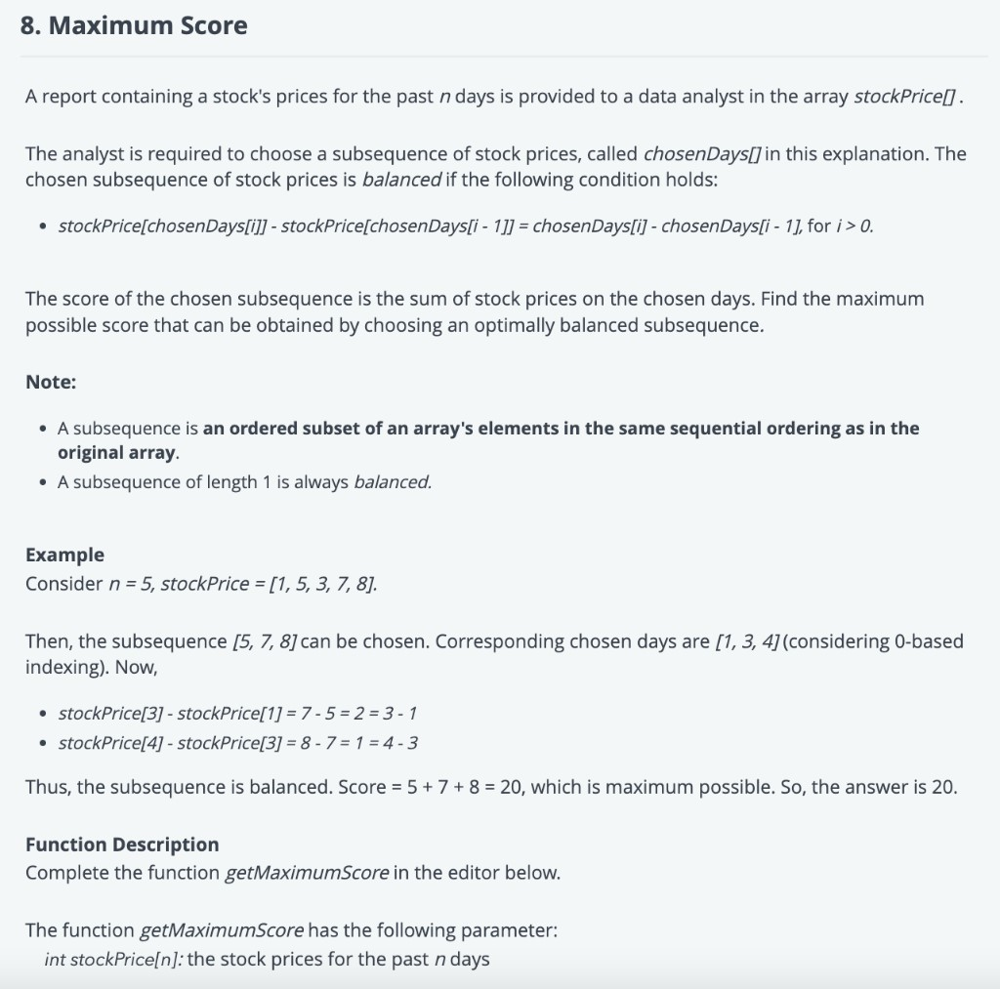

Refer Problem: 

Run: 
./multi_rate_limiter.py

Output:
stockPrices = [1, 5, 3, 7, 8]
print(getMaximumScore(stockPrices))  # Output: 20

stockPrices = [1, 2, 3]
print(getMaximumScore(stockPrices))  # Output: 6

Logic: 
The logic behind the code involves dynamic programming to solve the problem of finding the maximum score for a balanced subsequence of stock prices.

Here's how the logic works step by step:

1. Initialize an array `dp` of length `n`, where `n` is the number of days (length of `stockPrices`). This array will store the maximum score for a balanced subsequence ending at each index.

2. Iterate over each day from the second day (`i` starts from 1) up to the last day.

3. For each day, initialize `dp[i]` with the price of the current day (`stockPrices[i]`). This is because a subsequence of length 1 is always balanced and its score is simply the price of that day.

4. Now, iterate backwards (`j` goes from `i - 1` down to 0) to consider all the previous days before the current day.

5. Calculate the difference in days (`diff_days`) and the difference in prices (`price_diff`) between the current day and the previous day.

6. Check if the calculated `price_diff` is equal to `diff_days`. If this condition is satisfied, it means that adding the current day to the subsequence maintains the balance condition. In this case, update `dp[i]` by taking the maximum of its current value and `dp[j] + stockPrices[i]`. This step is where the dynamic programming approach comes into play, as it considers the previous day's maximum score and the current day's price to build the optimal subsequence score.

7. After considering all possible previous days, update `dp[i]` once again by taking the maximum of its current value and `dp[i - 1]`. This step accounts for the possibility of not selecting the current day, ensuring that the subsequence remains balanced.

8. Finally, the maximum value in the `dp` array represents the maximum score that can be obtained by choosing an optimally balanced subsequence.

9. Return the maximum value in the `dp` array as the output.
